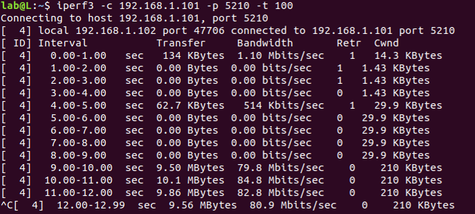

# Project : WiFi-Hacking
## Table of Contents

- [Overview](#overview)
- [Usage](#usage)
- [Challenge_Problem](#challenge_Problem)
- [Linux_Installation](#Linux_Installation)
- [Linux_Basics](#Linux_Basics)
- [Module_Basics](#Module_Basics)


## Overview

The WiFi-Hacking project is developed for EE 314. It applies an array of kernel programming techniques to hack your WiFi. However, the project does not focus on understanding full mac80211 protocol in wireless drivers. Instead, it teaches foundational mac80211 concepts, such as AIFS, CW, and CCA threshold. These concepts underly real-world device drivers.

We designed this project with three goals in mind. The project allows you to visualize the result of the techniques you implement. It is based on Atheros drivers and also contains some code demos, but does not force you to read the lengthy code. Finally, WiFi-Hacking provides a challenging problem that demands extra effort; real-world kernel problems are more challenging. Happy Hacking!


> #### Read this README with the following order...
``` python
if (familiar_with Linux and kernel_module):
    goto Usage + Challenge_Problem
elif know nothing:
    goto Usage
else:
    follow all the sections

```


----

## Usage

### Table of Contents

- [Introduction](#introduction)
- [Module_tips](#module_tips)
- [Throughput_test](#Throughput_test)
- [Visualization](#Visualization)
- [Expectation](#Expectation)

### Introduction
> Experiment Environment:

The project for this class assumes that you use Ubuntu 18.10 with kernel version 4.18.0.
The experiment environment we provide for you will contain the following:
- AIFS Desktop(Ubuntu 18.10, atheros ar9xxx wireless card, project files)
- Refence Desktop(On the way)
- Router
- Server(On the way)


> Project Files:

 The project files come from [backport driver](https://mirrors.edge.kernel.org/pub/linux/kernel/projects/backports/stable/v4.19.7/). Because this `backport driver` contains too many drivers and configuration files, we simplify configuration files and only leave you with the ath9k driver in this project.


> Files to Edit: 

We have given you a tutorial in class. The tutorial file is in `Documentation` directory. We mentioned that `struct ieee80211_ops` defines the interface of IEEE 80211 protocol and the drivers implemented this interface(the functions we have highlighed). In the directory `drivers/net/wireless/ath/ath9k/`,You will fill in portions of `mac.c` or `main.c` during the project. The intersting thing is that these functions only need to be executed in the init phase. Please do not change the other files in this project.

> Install modified Driver:

As mentioned above, the configuration file is simplified. `Makefile` script will compile the whole project and install modules. Make sure you are in the same directory with `Makefile`.
`Makefile` supports the following commands:
- `make help`   ------------------> helpfile
- `make -j Num`---------------> compile project with Num thread
- `make install`-------------> install driver
- `make uninstall`---------> uninstall driver

When you open a terminal window, you're placed at a command prompt. You could type commands in the terminal.
```shell
$ make help
$ sudo make install
$ sudo make uninstall
```

> Helpful websites:

- [linux wireless](https://wireless.wiki.kernel.org/) contains lots of information about wireless drivers.
- [LXR](https://elixir.bootlin.com/linux/latest/source) is used for cross reference of linux source code.
- [Kernel.org](https://www.kernel.org/doc/html/latest/driver-api/80211/mac80211-advanced.html) descibes the mac80211 subsystem.
- [Document](https://wireless.wiki.kernel.org/_media/en/developers/documentation/mac80211.pdf) is a PDF file about wireless architecture.

-----
### Module_tips
>Module operation

- `insmod`,`depmod`,`lsmod`,`modprobe`,`rmmod`,`modinfo` ...
- helpfile of these commands, look up their manuals:
```sh
$ man depmod
$ man modprobe
```

----
### Throughput_test
> Experient Environment:

- One server,one router and two clients.  


----
### Visualization
> Split data from logged file (optional)
- Some students may record data by hands. We suggest that you get the thoughput to a file, and write a program to get data. you could refer to [pacmea](https://github.com/jeter1112/pacmea/blob/master/meapac/flog.py). Write your own program to free your hands. 
----
### Expectation
> Sample result

- The throughput of Reference Host should be near to 0 Mbits/sec.

-----


## Challenge_Problem

> Advanced Visualization

Here, The problem is that how to visualize interframe duration.  
In ath9k driver, `ath_dbg` function will print information in kernel.you could 
observe the time stamp by using `kernelshark` software. After you insert
`ath_dbg` in the right position(send frame finished), you could get the 
interframe duration by calculating the delta time.


## Linux_Installation

> Install Ubuntu 18.10

You should install the system by yourself. 

## Linux_Basics

> Reference

Some shell commands is enough.  
[Berkely CS188](https://inst.eecs.berkeley.edu/~cs188/fa18/project0.html#UNIXBasics)

